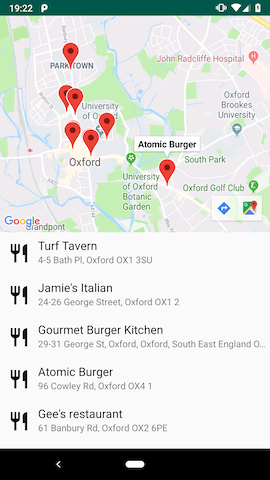

Nearby Restaurants
=========================
The app shows nearby restaurants and uses Jetpack components.

Screenshots
-----------

Libraries Used
--------------
* [Google Maps][0] for showing results on Map.
* [Zomato API][1] for fetching nearby restaurants.
* [Data Binding][2] for binding observables with UI elements.
* [LiveData][3] for reactive style programming.
* [Room][4] for local storage.
* [Koin][5] for dependency injection.
* [Retrofit][6] for REST api communication.
* [Moshi][7] for JSON deserialization.
* [Binding collection adapter][8] for binding collections to recyclerviews.
* [Timber][9] for logging.

[0]: https://developers.google.com/maps/documentation/android-sdk/intro
[1]: https://developers.zomato.com/api
[2]: https://developer.android.com/topic/libraries/data-binding/
[3]: https://developer.android.com/topic/libraries/architecture/livedata
[4]: https://developer.android.com/topic/libraries/architecture/room/
[5]: https://github.com/InsertKoinIO/koin
[6]: https://github.com/square/retrofit
[7]: https://github.com/square/moshi
[8]: https://github.com/evant/binding-collection-adapter
[9]: https://github.com/JakeWharton/timber

TODO
-----------------
* Unit & Instrumentation tests
* Better error handling

